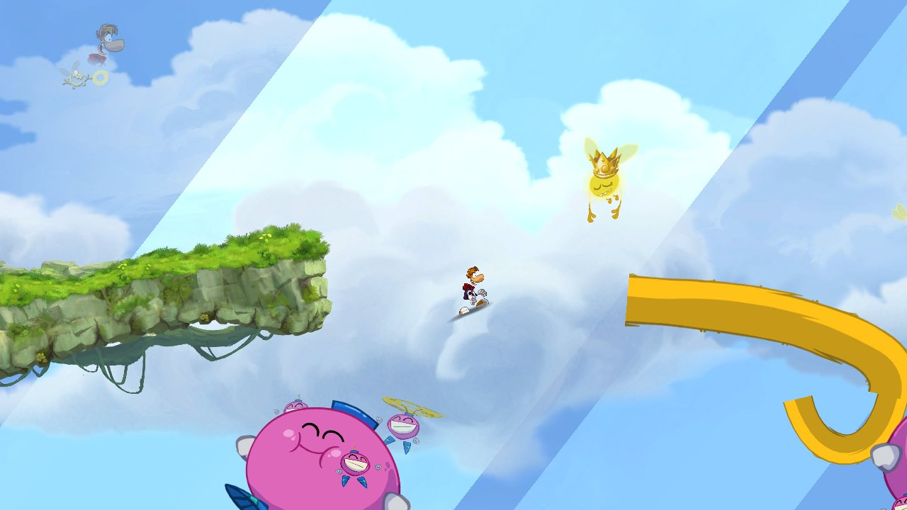
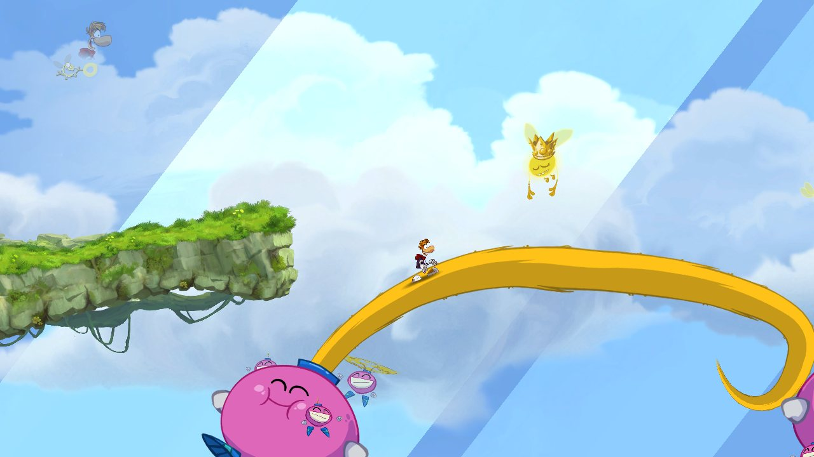
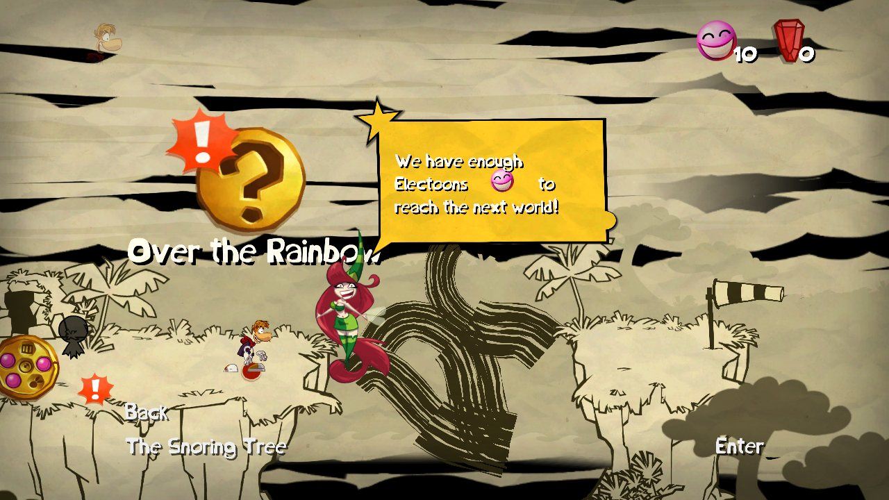
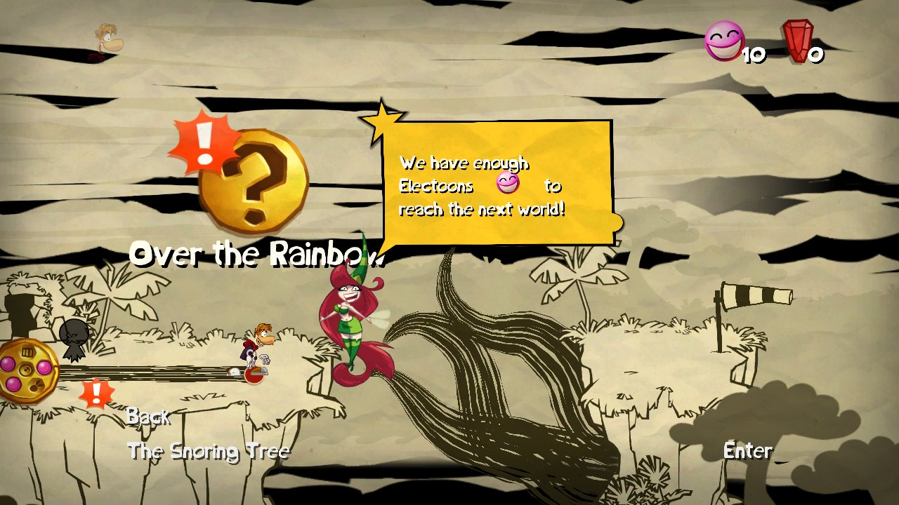

# Native renderer

The game can run **without Xbox 360 GPU emulation**. Its Direct3D draw calls are intercepted at the D3D level and drawn with Vulkan, using the game's own shaders recompiled ahead of time to SPIR-V. It runs on macOS (MoltenVK) and Android.

| | Xenos emulation | Native renderer |
|---|---|---|
| Apple M1, title screen | 30–55 fps, 100–620 ms stalls | **~59 fps**, native window resolution |
| Galaxy S23 (Adreno 740) | slow, stalls | **60 fps**, worst frame ~18 ms |

How the pieces fit is in [D3D_MAP.md](D3D_MAP.md); the investigation is in [PROGRESS.md](PROGRESS.md) section 7.

## How it works

- `rex/src/native_capture.cpp` hooks the game's D3D: `CreateVertexShader`/`CreatePixelShader` (hashes each shader container with XXH3, the key the SPIR-V is named by) and the three draw entry points.
- For each draw, `tools/native_renderer/vk_renderer.h` reads the Xenos register shadow that D3D keeps in its device structure: fetch constants, shader constants and render state. It then copies the vertices and indices (big-endian to little-endian), decodes the textures (`xenos_texture.h`: tiling, packed mips, DXT1/3/5, 8888), picks a pipeline for the shaders and blend state, and draws.
- Draw entry points: DrawIndexed, DrawVertices and DrawVerticesUP (`sub_826D7128`, vertices inline). Triangle lists, strips, fans and quad lists all become indexed triangle lists.
- Vertex layout: D3D patches the shaders' vertex fetches at draw time from the stream stride (`device + 0x3268 + stream` holds stride / 4), so the stride picks the UbiArt vertex struct (16 PC, 20 PT, 24 PCT, 28 font, 36 PNCT, 64 patch) and the shader's inputs pick attributes from it. The filled-in fetches live in the shader object's per-declaration bindings (`vs + [vs + 896 + 8i]`, microcode at `[binding + 872] + [vs + 32]`, see `sub_826E9B28`); `RAYMAN_NATIVE_FETCH_LOG=1` logs them, and they match the structs above.
- Render targets: each draw goes to the target named by `RB_SURFACE_INFO` / `RB_COLOR_INFO` (`device + 0x2880 / 0x2884`) with the game's viewport (`PA_CL_VPORT_*`, `device + 0x2908`). The widest target is the back buffer; it is drawn at screen resolution and blitted to the window, letterboxed. `Clear` (`sub_826D6B98`) clears the current target; `Resolve` (`sub_826D9588`) copies a rectangle of it into a texture registered at the destination address, which later draws sample instead of guest memory (AfterFx glow/blur, refraction). The destination texture's fetch constant is at `texture + 0x1C` (after the D3DResource header and `MipFlush`), and its address is virtual (`0xE0000000+`): it is registered under the physical address the sampling draws use, `(addr & 0x1FFFFFFF) + 0x1000`.
- `rexgpu-null` (ReXGlue plugin, `android/rexglue-patches/0003-0004`) keeps the guest GPU protocol running (ring buffer, fences, interrupts, vblank) without drawing, and leaves the window to the native renderer.

The shaders need no 64-bit integers or buffer device addresses (`hlsl_ubo.py` moves XenosRecomp's constants to uniform buffers), so stock Adreno drivers work.

## Fixes to the recompiled shaders

XenosRecomp was written for another game, and Rayman's shaders use Xenos features it gets wrong. The renderer corrects them when it loads the SPIR-V (`spirv_patch.h`, `spirv_inputs.h`), so the shaders don't need rebuilding.

**`setp_inv` (friezes: the map's vines, the sky bridge).** UbiArt draws its curved strips ("friezes", vertex shader `DDADD473…`) by evaluating a Bézier per vertex from control points in the constants, with predicate-counter instructions choosing the segment and the fade. The Xenos scalar `setp_inv` is `src == 1 ? 0 : (src == 0 ? 1 : src)` (`ucode.h`, `kSetpInv`); XenosRecomp emits `src == 0 ? 1 : src` and drops the first case. The counter then stays at 1, the following `setp_*_push` counts 2 instead of 1, and the `== 1` branch that interpolates the curve's parameter and alpha never runs. The first segment of the tail that makes the sky bridge was left at alpha 0 (invisible), and the map's vines broke into straight pieces. `FixSetpInv` rewrites every `select(a == 0.0, 1.0, a)` as `select(a == 1.0, 0.0, select(a == 0.0, 1.0, a))`.

| | Before | After |
|---|---|---|
| Sky bridge (the tail Rayman walks on) |  |  |
| World map vines |  |  |

Rendered on a PC from frame dumps taken on the phone (below). The vines look dark there because that map dump predates full-size texture dumps; on the device they have their art.

**Relative constant addressing.** Shaders that index constants with a computed index (`c[a0 + n]`, the friezes again) get arrays sized by the registers the microcode names, but the index can run past them (up to c224 where the declared block ends at c208). Those shaders get the whole 256-register file, as on the console.

## Debugging on a PC with frames from the phone

A rendering bug seen on the device can be reproduced and fixed on a PC, without the phone:

```sh
# On the device, with the native renderer, at the broken spot:
adb shell touch /sdcard/Android/data/io.github.belmantegu.raymanrecomp/files/captures/dump_now
adb pull /sdcard/Android/data/io.github.belmantegu.raymanrecomp/files/captures/native_frame.bin private/captures/
# On the PC: the same frame through the same renderer (it picks the discrete GPU)
vkrender private/captures/native_frame.bin private/native/spirv_ubo out.tga
VKRENDER_ONLY=0,12 vkrender ...     # only those draws, to isolate one
```

The dump (`RAYMAN_CAPTURE_DIR`, set by the app to its files folder) holds every draw's D3D state, the memory it reads and the shader containers: game data, keep it in `private/`. `tools/native_renderer/dumpview` prints the draws and decodes the textures.

## Build the SPIR-V shaders (once, from your own game files)

```sh
tools/diag/build.sh && tools/diag/imagedump private/game/default.xex private/data/image.bin
# build tools/forks/xenosrecomp (hedge-dev/XenosRecomp) and tools/native_renderer/shaderprep first
sh tools/native_renderer/build_spirv.sh      # -> private/native/spirv_ubo/<HASH>_{vs,ps}.spv
```

The output is derived from the game: it stays in `private/`.

## Run

- **macOS:** `sh rex/run_native.sh`. Needs `librexgpu-null.dylib` next to the executable (ReXGlue built with the patches).
- **Android:** the native renderer is the default (launcher → *Graphics: Vulkan*). `android/build_apk.sh` packs the shaders from `private/native/spirv_ubo` into your local APK; the launcher extracts them on first run.

### Widescreen

`RAYMAN_WIDESCREEN=<aspect>` (or `auto` for the window's aspect) makes the game frame a wider scene instead of 16:9: it patches UbiArt's two 16:9 fit constants (16/9 at `0x8201EF58`, 9/16 at `0x8201EF5C`, used by `sub_824C8798`) and the renderer fits that aspect into the window. The guest video mode has to match, e.g. on macOS:

```sh
RAYMAN_WIDESCREEN=auto sh rex/run_native.sh --fullscreen=false --window_width=1560 --window_height=720 \
    --video_mode_width=1560 --video_mode_height=720
```


On Android it is on by default with the native renderer: the app sets a 720-line video mode with the display's aspect (19.5:9 on a Galaxy S23).

## Status

The title screen, menus, world map and the first level render correctly (checked headless, below). Diagnostics: skipped draws and their reason every 300 frames (`[native] skipped xN: ...`). Movies play (quad lists, 8-bit planes, textures refreshed when their content changes).

Coverage: every texture in the game's bundles (8,358, scanned offline) uses DXT1, DXT2/3, DXT4/5 or 8888, all supported. The resolve path works in-game: the water's refraction (the scene under the waterline) renders since the resolve address fixes above; before them it was black.

On Android the renderer survives the app going to the background: frames are dropped (and the game held) while there is no window, and the surface and swapchain are rebuilt for the new one.

## Headless test runs (macOS)

No window and no sound, for automated checks: `RAYMAN_NATIVE_RENDER=offscreen` (renderer into an image, `RAYMAN_OFFSCREEN_SIZE=WxH`), `SDL_VIDEO_DRIVER=offscreen`, `--audio_mute=true`, and `RAYMAN_AUTOPILOT` to drive a virtual pad (`rex/src/autopilot.cpp`), e.g. `RAYMAN_AUTOPILOT="18:start,22:a,25:a,50:right,52:jump"`. With `RAYMAN_CAPTURE=1` frames land in `rex/captures/`. Use a separate `HOME` so the run doesn't touch your save.
